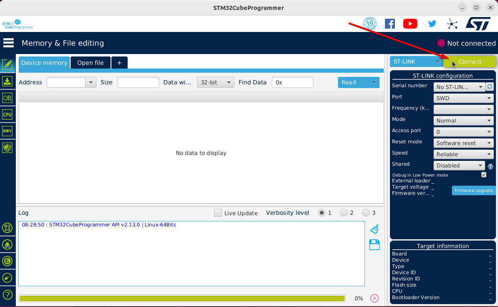
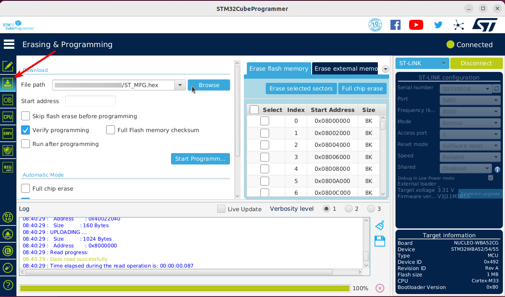
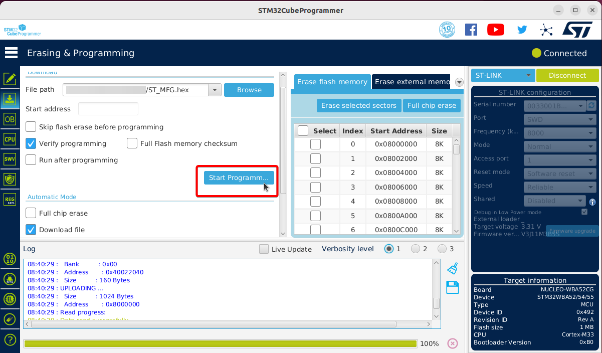
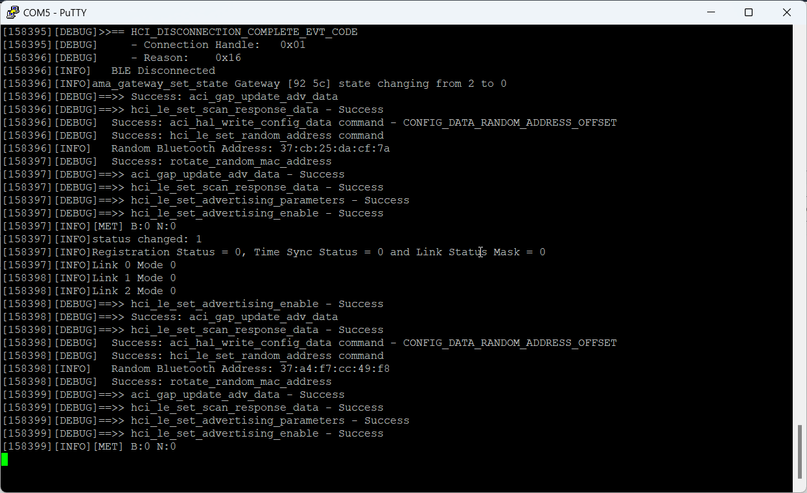

## Step by step
1) Open STM32CubeProgrammer utility and click on **Connect**  

2) Go to **Erasing & Programming** tab and browse *ST_MFG.hex* (from EdgeDeviceProvisioning)

3) Flash the board by clicking on **Start Programm...**  

4) Browse *application.hex* (from EdgeDeviceBinaries) and flash the board again.

5) After programming the board, open the serial port connection in any terminal for logs  

